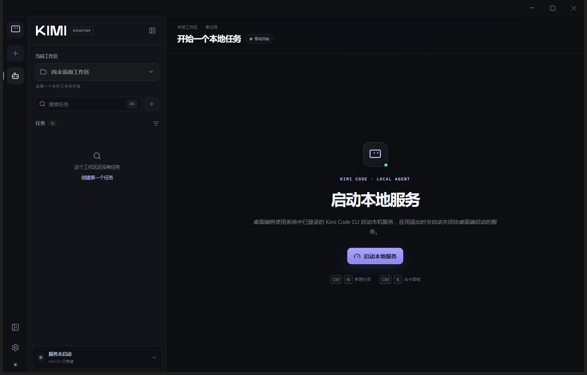

# Kimi Code Desktop

一个面向 Windows 的**非官方 Kimi Code 桌面客户端**。它直接识别并调用系统中已经安装、已经登录的 Kimi Code CLI，把本地 Agent 的工作区、任务、执行过程、工具调用、审批和提问收拢到一个现代化中文桌面工作台中。

> [!IMPORTANT]
> 本项目不是 Moonshot AI 的官方桌面发行版，也不会修改或重新发布上游 CLI。Kimi Code、相关名称与品牌资源归其权利人所有。本项目以独立仓库维护，并在 [THIRD_PARTY_NOTICES.md](THIRD_PARTY_NOTICES.md) 中保留上游 MIT 许可与归属说明。



## 产品定位

Kimi Code Desktop 是系统级 CLI 的桌面外壳，而不是某个代码仓库中的插件：

- 自动发现 Windows 环境中的 `kimi` 命令，也支持手动选择 `kimi.cmd` 或可执行文件。
- 复用 CLI 已有的登录态、模型配置、本地服务和任务数据。
- 桌面端启动的 CLI 服务会在应用退出时一并关闭；连接到外部既有服务时不会擅自结束它。
- CLI 仍然是能力来源，桌面端只负责更清晰的交互、状态呈现和本机工作流。

## 当前能力

- **工作区管理**：选择本机文件夹、切换工作区，并只展示当前工作区的任务。
- **任务管理**：创建、搜索、切换、重命名和归档任务，并可在归档管理器中恢复历史任务。
- **结构化执行时间线**：将命令、文件读写、搜索、网络访问、Agent 调用、待办和后台任务转换为带状态、进度、输入与输出的现代化工具卡片；无法识别的新工具会安全降级展示。
- **文件差异审阅**：文件编辑可打开独立 Diff 面板，查看增删行、复制差异、复制绝对路径，并可在 Windows 资源管理器中定位真实文件。
- **行内审批与计划审阅**：审批会锚定在对应工具调用后方，显示命令、工作目录、风险提示、文件差异或实施计划；支持可选反馈和上游提供的计划选项。
- **任务交互**：处理问题、待办和子任务活动；右侧面板显示待办完成度、中文后台任务状态、子 Agent 标识、输出尾部与错误详情。
- **模型与思考策略**：从本地 Kimi Code 服务读取模型能力，切换模型、思考强度、权限模式和计划模式；界面只显示服务端已经确认的运行状态。
- **上下文管理**：显示上下文 token 用量、运行策略和兼容性警告，支持按需压缩当前任务上下文。
- **任务分支与回退**：撤回上一轮请求并恢复到输入框，或从当前上下文派生一个独立的新任务。
- **运行控制**：启动、连接、停止本机服务，停止正在运行的任务，并在退出应用前明确确认。
- **中文界面**：工作台、设置、错误提示和主要交互均使用中文。
- **快捷操作**：`Enter` 发送，`Ctrl + Enter` 换行，`Ctrl + N` 新建任务，`Ctrl + B` 切换侧边栏，`Ctrl + K` 打开命令面板；命令面板也可刷新运行状态、切换计划模式、撤回、压缩、派生和打开归档管理。

## 界面原则

界面采用 Codex 风格的信息架构：窄导航栏、工作区/任务侧边栏、任务画布、固定输入区和按需展开的上下文面板。视觉实现使用 React、Radix UI、Lucide 图标与项目自有样式，重点保证：

- 任务状态始终可见；
- 输入与发送按钮在常见窗口尺寸下始终可用；
- 高风险审批和普通任务信息有明确层级；
- 不把终端日志原样堆给用户，而是尽量转换成结构化时间线。

## 使用要求

- Windows 10 或 Windows 11（x64）。
- 已安装并登录 Kimi Code CLI。在 PowerShell 中运行以下命令应能显示版本：

  ```powershell
  kimi --version
  ```

桌面端不会把认证 token 暴露给渲染进程，也不会在界面状态中保存 token。主进程只连接本机 loopback 服务，并通过受限 IPC 向界面提供经过校验的数据。

## 运行策略与兼容性

选择一个任务后，输入框下方会显示当前模型支持的运行策略：

- **思考强度**：优先使用模型目录声明的可用档位；旧模型没有声明时退化为“关闭 / 开启”。
- **权限模式**：支持手动确认、YOLO 和完全自动，并在菜单中说明每种模式的行为差异。
- **计划模式**：开启后先制定方案，再按上游服务支持的流程继续执行。
- **上下文状态**：右侧“详情”面板显示 token 用量、策略状态和服务返回的警告。

这些状态以本地 Kimi Code 服务返回值为准，不使用未经确认的乐观状态。桌面端兼容 Kimi Code CLI `0.30.x` 的既有本地服务，并会对 `0.31.x` 及后续版本新增的结构化工具、审批与计划审阅字段进行能力检测；缺失字段会回退到安全的通用展示。若系统中的 CLI 版本尚未提供对应接口，桌面端会显示“当前 CLI 不支持运行策略控制”，但工作区、对话、时间线和已有任务功能仍可正常使用。升级系统 CLI 后重新启动桌面端即可自动使用新能力。


## 0.4.0 执行审阅体验

`0.4.0` 重点把 CLI 的执行事实转换为适合桌面工作的审阅界面：

- 命令、文件、搜索、网络、Agent、任务与待办统一使用结构化执行卡片；
- 运行中与失败工具默认展开，已完成工具保持紧凑，可按需查看原始结构化输入、输出和进度；
- 文件修改提供逐行 Diff、增删统计、复制内容与 Windows 资源管理器定位；
- 审批紧跟对应工具调用，反馈提交失败时保留草稿，避免重复输入；
- 计划审阅显示完整计划和服务端选项，并原样提交所选 `selected_label`；
- 后台任务和子 Agent 使用中文状态、待办进度和独立详情面板呈现。

桌面端不会替换、打包或修改系统中的 Kimi Code CLI。所有任务能力仍由本机 CLI 和本地服务提供，本项目仅做经过校验的本机连接与 UI/UX 增强。

## 本地开发

开发环境要求：

- Node.js `>= 24.11.1`
- pnpm `10.33.0`

```powershell
git clone https://github.com/wjt0321/kimi-code-desktop.git
cd kimi-code-desktop
pnpm install
pnpm dev
```

如访问依赖源受限，可在当前 PowerShell 会话中配置自己的 HTTP/HTTPS 代理后再执行安装命令。

## 验证

```powershell
pnpm typecheck
pnpm test
pnpm exec electron-vite build
```

## Windows 打包

生成免安装目录版本：

```powershell
pnpm build:dir
```

可执行文件位于：

```text
release/<版本号>/win-unpacked/Kimi Code Desktop.exe
```

生成 NSIS 安装程序：

```powershell
pnpm build
```

安装程序与免安装目录按版本输出到 `release/<版本号>/`，避免 Windows 对同路径 EXE 沿用旧图标缓存。

## 常见问题

### 桌面端找不到 CLI

先确认 PowerShell 中的 `kimi --version` 可用。如果 CLI 安装在非标准位置，可在桌面端的 CLI 就绪页面手动选择 `kimi.cmd` 或对应可执行文件。

### 选择文件夹后没有任务

工作区和任务是两个独立概念。打开工作区后，点击“新建任务”创建该工作区下的任务；切换到没有任务的工作区时，主画布会回到新建任务状态。

### 为什么有些 CLI 功能还没有图形入口

桌面端优先接入上游稳定的本地服务接口。当前已经接入运行策略、上下文用量、压缩、撤回、任务派生、归档恢复、结构化工具结果、文件差异审阅、行内审批、计划选项和后台任务详情。CLI 与 Web 能力继续演进后，还会补齐更多配置、用量明细、会话级 Agent 管理和更完整的服务能力。未接入的功能仍可直接在原 CLI 中使用。

## 上游与许可

- 上游项目：[MoonshotAI/kimi-code](https://github.com/MoonshotAI/kimi-code)
- 本项目：[wjt0321/kimi-code-desktop](https://github.com/wjt0321/kimi-code-desktop)
- 本项目许可：[MIT License](LICENSE)
- 上游资源与许可：[THIRD_PARTY_NOTICES.md](THIRD_PARTY_NOTICES.md)

感谢 Moonshot AI 与 Kimi Code 社区。本项目的目标是以开源方式为喜欢 Kimi Code CLI 的 Windows 用户提供更方便的桌面体验。
